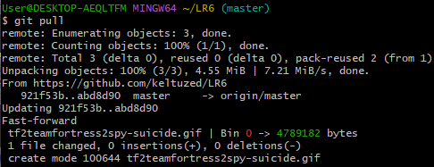
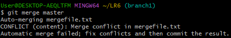
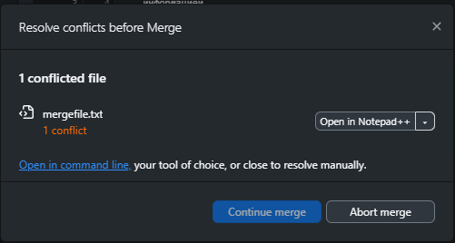
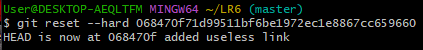
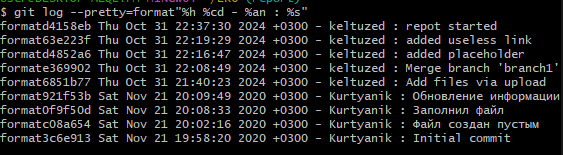

# LR6
## Лабораторная работа №6
### Цель лабораторной работы

Изучение базовых возможностей системы
управления версиями, опыт работы с Git Api, опыт работы с локальным и
удаленным репозиторием.
### Ход выполнения

#### Изображения


Рисунок 1 - Скриншот втягивания изменений после загрузки файла через интерфейс



Рисунок 2 - Скриншот наличия конфликта объединения ветвей



Рисунок 3 - Скриншот разрешения конфликта при помощи Github Desktop



Рисунок 4 - Скриншот откат коммита



Рисунок 2 - Скриншот форматированой истории операций

#### Лог комманд
```bash
40  git clone https://github.com/keltuzed/LR6
41  git pull origin
42  git pull origin master
51  cd C:/Users/TEMP.DESKTOP-AEQLTFM.003/LR6
62  git pull origin
63  git log --branches
64  cd C:/Users/TEMP.DESKTOP-AEQLTFM.003/LR6
65  git branch
66  git merge master
67  git pull
68  git pull branch1
71  git checkout branch1
72  git pull remotes/origin/branch1
73  git remote add origin git@github.com:keltuzed/LR6.git
74  git pull remotes/origin/branch1
75  git branch
76  git merge master
77  git branch master
78  git master
79  git checkout master
80  git checkout master
81  git add .
82  git pull
83  git checkout branch1
84  git merge master
85  git checkout master
86  git add .
87  git commit -m"Разрешение конфликта"
88  git branch -d branch1
89  git add .
90  git commit -m"added placeholder"
91  git add .
92  git commit -m"added useless link"
93  git add .
94  git commit -m"added useless letters"
95  git reset c74363378c64762829fc65ae1cb71ed9cb98f29c
96  git reset
97  git reset c74363378c64762829fc65ae1cb71ed9cb98f29c
98  git reset --hard c74363378c64762829fc65ae1cb71ed9cb98f29c
99  git reset --hard 63e223fc2c2c3d0bcf66cf042985b848dd66fb7a
100  git branch report
101  git chechout report
102  git checkout report
103  git reflog
104  history
```
### Вывод

Изучил базовые возможности системы
управления версиями, получил опыт работы с Git Api, опыт работы с локальным и
удаленным репозиторием.